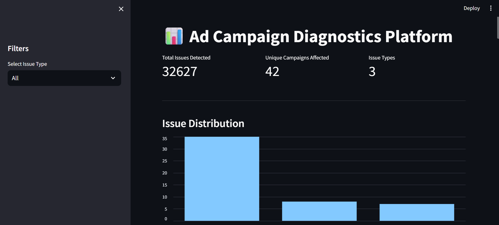

# AI Ad Campaign Diagnostics & Troubleshooting Platform

An AI-powered platform for diagnosing advertising campaign issues and providing automated troubleshooting suggestions using Retrieval-Augmented Generation (RAG).

This project simulates how ad-tech support systems help advertisers diagnose problems in campaign performance data.

---

## Overview

The system analyzes advertising campaign metrics, detects common issues such as low CTR or exhausted budgets, and provides AI-generated troubleshooting explanations using a RAG pipeline.

Users can explore campaign diagnostics through a dashboard and ask natural language questions about campaign issues.

---

## Features

- Campaign diagnostics engine
- Automated issue detection
- Retrieval-Augmented Generation (RAG)
- Vector search using FAISS
- LLM-powered troubleshooting assistant
- Interactive dashboard
- Support ticket simulation
- Campaign analytics visualization

---

## System Architecture

Streamlit UI
↓
FastAPI Backend
↓
Retriever (FAISS + Embeddings)
↓
Relevant Campaign Issues + Support Tickets
↓
TinyLlama / HuggingFace LLM
↓
Generated Troubleshooting Answer

---

## Tech Stack

**Backend**
- FastAPI
- Python

**Frontend**
- Streamlit

**AI / ML**
- Sentence Transformers
- FAISS
- HuggingFace Transformers
- TinyLlama / FLAN-T5 (depending on configuration)

**Data Processing**
- Pandas
- NumPy

---

## Project Structure

ads-diagnostics-platform
│
├── api
│ └── main.py # FastAPI backend
│
├── backend
│ ├── analyzer.py # Campaign diagnostics logic
│ ├── rag.py # FAISS vector retrieval
│ └── rag_assistant.py # LLM generation
│
├── dashboard
│ └── app.py # Streamlit UI
│
├── campaigns_dataset.csv # Synthetic campaign data
├── support_tickets.csv # Simulated advertiser tickets
│
├── data.py # Campaign dataset generator
├── data_tickets.py # Ticket dataset generator
│
├── requirements.txt
└── README.md

---

## How It Works

1. Campaign data is generated using synthetic datasets.
2. The diagnostics engine analyzes campaign metrics.
3. Issues are converted into vector embeddings.
4. FAISS retrieves the most relevant issues.
5. A language model generates troubleshooting guidance.
6. Users interact with the system via a Streamlit dashboard.

---

## Example Query

User question:

Why did my campaign stop running?

AI response:

The campaign may have stopped running because the daily budget has been exhausted.
Increasing the campaign budget or adjusting bidding strategy can help resume delivery.

---

## Running the Project

### 1️⃣ Install dependencies

pip install -r requirements.txt

---

### 2️⃣ Generate datasets

python data.py
python data_tickets.py

---

### 3️⃣ Start the FastAPI backend

uvicorn api.main:app --reload

Backend will run at:

http://127.0.0.1:8000

API documentation:

http://127.0.0.1:8000/docs

---

### 4️⃣ Start the Streamlit dashboard

streamlit run dashboard/app.py

Dashboard will run at:

http://localhost:8501

---

## Dashboard Features

- Campaign diagnostics summary
- Issue distribution charts
- Campaign investigation tools
- AI troubleshooting assistant
- Support ticket simulation

---

## Example Use Cases

- Diagnose campaign delivery issues
- Investigate low CTR campaigns
- Identify budget limitations
- Debug conversion tracking problems
- Simulate advertiser support queries

---

## Future Improvements

- Real Google Ads API integration
- Advanced anomaly detection
- LLM fine-tuning on advertising data
- Multi-campaign root cause analysis
- Cloud deployment

---

## Author

Built as a full-stack AI diagnostics system demonstrating:

- AI systems engineering
- RAG pipelines
- API development
- data analytics dashboards
